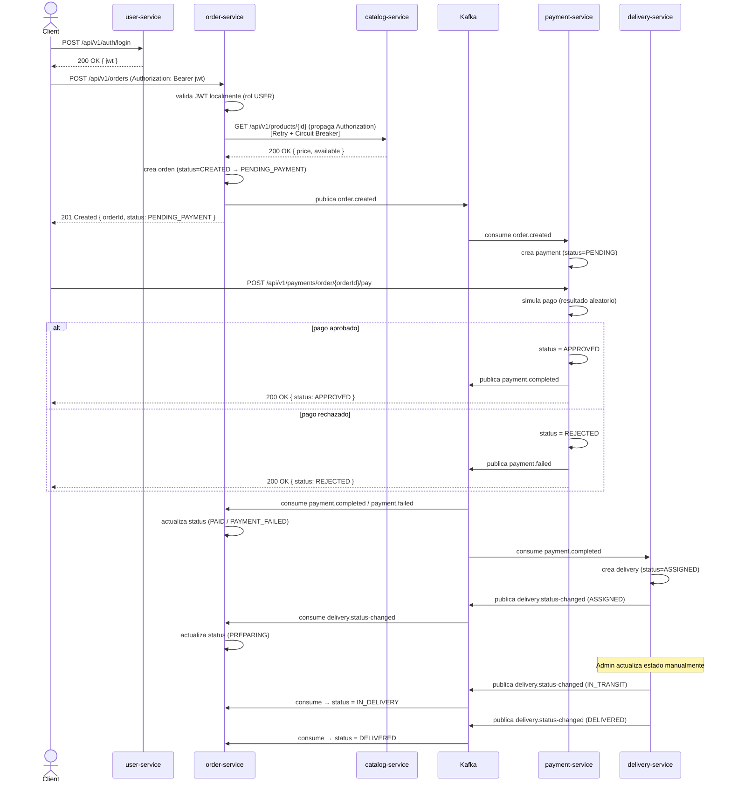

# Sistema de Pedidos de Comida — Documento de Arquitectura Técnica

**Estilo arquitectónico:** Microservicios + Event-Driven Architecture, Clean Architecture por servicio
**Fecha:** Agosto 2026

> Este documento es una vista **arquitectónica** del sistema: describe qué existe, cómo se comunica y por qué, sin entrar en detalles de construcción (Maven, Dockerfiles, estructura de paquetes archivo por archivo).

---

## 1. Resumen

Sistema de pedidos de comida para un único restaurante, compuesto por **5 microservicios independientes** (usuarios, catálogo, pedidos, pagos, entregas), cada uno con su propia base de datos PostgreSQL. La comunicación combina **REST síncrono** (solo donde es estrictamente necesario) y **eventos asíncronos vía Kafka** (para el flujo transaccional principal: pago → entrega). No existe API Gateway: cada servicio se expone directamente.

### 1.1 Objetivos de diseño

- Separar el dominio en microservicios con responsabilidad única y base de datos propia.
- Minimizar el acoplamiento síncrono entre servicios, favoreciendo coreografía de eventos.
- Seguridad basada en JWT emitido centralizadamente y validado localmente en cada servicio.
- Resiliencia explícita (Retry + Circuit Breaker) en el único punto de comunicación síncrona crítica.
- Observabilidad completa: métricas y trazabilidad distribuida.
- Internamente, cada servicio sigue Clean Architecture (dominio aislado de infraestructura).

### 1.2 Fuera de alcance

API Gateway, service discovery dinámico, notificaciones push/email, multi-restaurante, recuperación de contraseña y orquestador de sagas dedicado.

---

## 2. Stack tecnológico

| Categoría | Tecnología |
|---|---|
| Lenguaje | Java 21 |
| Framework | Spring Boot 3.5.6 |
| Persistencia | Spring Data JPA (Hibernate) |
| Base de datos | PostgreSQL 16 |
| Migraciones | Flyway |
| Mensajería | Apache Kafka (modo KRaft) |
| Seguridad | Spring Security + JWT (HS256) |
| Resiliencia | Resilience4j (Retry + Circuit Breaker) |
| Documentación API | OpenAPI 3 / Swagger UI |
| Métricas | Prometheus + Grafana |
| Trazabilidad distribuida | Zipkin |
| Contenerización / orquestación | Docker + Kubernetes |
| Arquitectura interna | Clean Architecture (domain / application / infrastructure) |

---

## 3. Diagrama de arquitectura general

<svg viewBox="0 0 940 480" xmlns="http://www.w3.org/2000/svg" role="img" aria-labelledby="title desc" font-family="Segoe UI, Helvetica, Arial, sans-serif">
  <title id="title">Arquitectura general del sistema de pedidos de comida</title>
  <desc id="desc">Diagrama de carriles mostrando cliente, cinco microservicios, Kafka, cinco bases de datos PostgreSQL y el bloque de observabilidad, sin API Gateway.</desc>

  <defs>
    <marker id="arrowGray" viewBox="0 0 10 10" refX="8" refY="5" markerWidth="6" markerHeight="6" orient="auto-start-reverse">
      <path d="M0,0 L10,5 L0,10 z" fill="#94a3b8"/>
    </marker>
    <marker id="arrowBlue" viewBox="0 0 10 10" refX="8" refY="5" markerWidth="6" markerHeight="6" orient="auto-start-reverse">
      <path d="M0,0 L10,5 L0,10 z" fill="#2563eb"/>
    </marker>
    <marker id="arrowDot" viewBox="0 0 10 10" refX="8" refY="5" markerWidth="5" markerHeight="5" orient="auto-start-reverse">
      <path d="M0,0 L10,5 L0,10 z" fill="#cbd5e1"/>
    </marker>
  </defs>

  <rect x="0" y="0" width="940" height="480" fill="#ffffff"/>

  <!-- BANDS -->
  <rect x="10" y="10" width="920" height="70" fill="#fafbfc" stroke="#e2e8f0"/>
  <text x="18" y="24" font-size="9" letter-spacing="1" fill="#94a3b8">CLIENTE</text>

  <rect x="10" y="85" width="920" height="70" fill="#ffffff" stroke="#e2e8f0"/>
  <text x="18" y="99" font-size="9" letter-spacing="1" fill="#94a3b8">SERVICIOS (sin API Gateway — cada uno expuesto directamente)</text>

  <rect x="10" y="160" width="920" height="75" fill="#fafbfc" stroke="#e2e8f0"/>
  <text x="18" y="174" font-size="9" letter-spacing="1" fill="#94a3b8">MENSAJERÍA — KAFKA (modo KRaft)</text>

  <rect x="10" y="240" width="920" height="75" fill="#ffffff" stroke="#e2e8f0"/>
  <text x="18" y="254" font-size="9" letter-spacing="1" fill="#94a3b8">DATOS — POSTGRESQL (una base por servicio)</text>

  <rect x="10" y="320" width="920" height="80" fill="#fafbfc" stroke="#e2e8f0"/>
  <text x="18" y="334" font-size="9" letter-spacing="1" fill="#94a3b8">OBSERVABILIDAD</text>

  <!-- CLIENT BOX -->
  <rect x="380" y="25" width="150" height="35" rx="6" fill="#ffffff" stroke="#94a3b8"/>
  <text x="455" y="47" font-size="11" fill="#1e293b" text-anchor="middle">Usuario Final</text>

  <!-- SERVICES -->
  <g font-size="10.5" fill="#1e293b">
    <rect x="20" y="100" width="150" height="40" rx="6" fill="#ffffff" stroke="#94a3b8"/>
    <text x="95" y="124" text-anchor="middle">user-service</text>

    <rect x="200" y="100" width="150" height="40" rx="6" fill="#ffffff" stroke="#94a3b8"/>
    <text x="275" y="124" text-anchor="middle">catalog-service</text>

    <rect x="380" y="100" width="150" height="40" rx="6" fill="#ffffff" stroke="#94a3b8"/>
    <text x="455" y="124" text-anchor="middle">order-service</text>

    <rect x="560" y="100" width="150" height="40" rx="6" fill="#ffffff" stroke="#94a3b8"/>
    <text x="635" y="124" text-anchor="middle">payment-service</text>

    <rect x="740" y="100" width="150" height="40" rx="6" fill="#ffffff" stroke="#94a3b8"/>
    <text x="815" y="124" text-anchor="middle">delivery-service</text>
  </g>

  <!-- KAFKA -->
  <rect x="430" y="185" width="230" height="38" rx="19" fill="#ffffff" stroke="#2563eb" stroke-width="1.4"/>
  <text x="545" y="209" font-size="11" fill="#1e3a8a" text-anchor="middle" font-weight="600">Apache Kafka</text>
  <text x="545" y="233" font-size="8" fill="#64748b" text-anchor="middle">topics: order.created · payment.completed · payment.failed · delivery.status-changed</text>

  <!-- DATABASES -->
  <g font-size="10" fill="#334155">
    <rect x="20" y="265" width="150" height="40" rx="4" fill="#ffffff" stroke="#94a3b8"/>
    <text x="95" y="289" text-anchor="middle">user_db</text>

    <rect x="200" y="265" width="150" height="40" rx="4" fill="#ffffff" stroke="#94a3b8"/>
    <text x="275" y="289" text-anchor="middle">catalog_db</text>

    <rect x="380" y="265" width="150" height="40" rx="4" fill="#ffffff" stroke="#94a3b8"/>
    <text x="455" y="289" text-anchor="middle">order_db</text>

    <rect x="560" y="265" width="150" height="40" rx="4" fill="#ffffff" stroke="#94a3b8"/>
    <text x="635" y="289" text-anchor="middle">payment_db</text>

    <rect x="740" y="265" width="150" height="40" rx="4" fill="#ffffff" stroke="#94a3b8"/>
    <text x="815" y="289" text-anchor="middle">delivery_db</text>
  </g>

  <!-- OBSERVABILITY -->
  <g font-size="10.5" fill="#1e293b">
    <rect x="200" y="355" width="150" height="40" rx="6" fill="#ffffff" stroke="#94a3b8"/>
    <text x="275" y="379" text-anchor="middle">Prometheus</text>

    <rect x="380" y="355" width="150" height="40" rx="6" fill="#ffffff" stroke="#94a3b8"/>
    <text x="455" y="379" text-anchor="middle">Grafana</text>

    <rect x="560" y="355" width="150" height="40" rx="6" fill="#ffffff" stroke="#94a3b8"/>
    <text x="635" y="379" text-anchor="middle">Zipkin</text>
  </g>

  <!-- CLIENT -> SERVICES -->
  <g stroke="#94a3b8" stroke-width="0.75" fill="none">
    <line x1="455" y1="60" x2="95" y2="100" marker-end="url(#arrowGray)"/>
    <line x1="455" y1="60" x2="275" y2="100" marker-end="url(#arrowGray)"/>
    <line x1="455" y1="60" x2="455" y2="100" marker-end="url(#arrowGray)"/>
    <line x1="455" y1="60" x2="635" y2="100" marker-end="url(#arrowGray)"/>
    <line x1="455" y1="60" x2="815" y2="100" marker-end="url(#arrowGray)"/>
  </g>
  <text x="700" y="72" font-size="8" fill="#64748b" text-anchor="middle">Authorization: Bearer &lt;JWT&gt; (validado localmente por cada servicio)</text>

  <!-- ORDER <-> CATALOG (sync REST) -->
  <line x1="380" y1="120" x2="350" y2="120" stroke="#334155" stroke-width="1.2" marker-end="url(#arrowGray)"/>
  <text x="365" y="112" font-size="7.5" fill="#334155" text-anchor="middle">REST · Retry + Circuit Breaker</text>

  <!-- ORDER <-> KAFKA -->
  <line x1="455" y1="140" x2="455" y2="185" stroke="#2563eb" stroke-width="1.1" stroke-dasharray="4,3" marker-end="url(#arrowBlue)" marker-start="url(#arrowBlue)"/>
  <text x="330" y="165" font-size="7.5" fill="#1e3a8a">order.created ⇄</text>
  <text x="330" y="176" font-size="7.5" fill="#1e3a8a">payment.* / delivery.status-changed</text>

  <!-- KAFKA <-> PAYMENT -->
  <line x1="635" y1="140" x2="635" y2="185" stroke="#2563eb" stroke-width="1.1" stroke-dasharray="4,3" marker-end="url(#arrowBlue)" marker-start="url(#arrowBlue)"/>
  <text x="655" y="165" font-size="7.5" fill="#1e3a8a">order.created ⇄</text>
  <text x="655" y="176" font-size="7.5" fill="#1e3a8a">payment.completed|failed</text>

  <!-- KAFKA <-> DELIVERY (elbow) -->
  <path d="M660,205 L815,205 L815,140" stroke="#2563eb" stroke-width="1.1" stroke-dasharray="4,3" fill="none" marker-end="url(#arrowBlue)" marker-start="url(#arrowBlue)"/>
  <text x="815" y="217" font-size="7.5" fill="#1e3a8a" text-anchor="middle">payment.completed ⇄ delivery.status-changed</text>

  <!-- SERVICES -> DBs -->
  <g stroke="#94a3b8" stroke-width="1" fill="none">
    <line x1="95" y1="140" x2="95" y2="265" marker-end="url(#arrowGray)"/>
    <line x1="275" y1="140" x2="275" y2="265" marker-end="url(#arrowGray)"/>
    <path d="M455,140 L455,160 L400,160 L400,265" marker-end="url(#arrowGray)"/>
    <path d="M635,140 L635,160 L690,160 L690,265" marker-end="url(#arrowGray)"/>
    <line x1="815" y1="140" x2="815" y2="265" marker-end="url(#arrowGray)"/>
  </g>

  <!-- OBSERVABILITY summary line -->
  <line x1="20" y1="315" x2="890" y2="315" stroke="#cbd5e1" stroke-width="0.75" stroke-dasharray="1,3"/>
  <line x1="455" y1="315" x2="455" y2="355" stroke="#cbd5e1" stroke-width="1" stroke-dasharray="1,3" marker-end="url(#arrowDot)"/>
  <text x="455" y="330" font-size="7.5" fill="#64748b" text-anchor="middle">métricas (/actuator/prometheus) y trazas (Zipkin) — los 5 servicios</text>

  <!-- LEGEND -->
  <g font-size="8.5" fill="#334155">
    <line x1="20" y1="415" x2="45" y2="415" stroke="#334155" stroke-width="1.2" marker-end="url(#arrowGray)"/>
    <text x="52" y="418">REST síncrono / conexión a base de datos</text>

    <line x1="280" y1="415" x2="305" y2="415" stroke="#2563eb" stroke-width="1.1" stroke-dasharray="4,3" marker-end="url(#arrowBlue)"/>
    <text x="312" y="418">Evento asíncrono (Kafka)</text>

    <line x1="510" y1="415" x2="535" y2="415" stroke="#cbd5e1" stroke-width="1" stroke-dasharray="1,3" marker-end="url(#arrowDot)"/>
    <text x="542" y="418">Métricas / trazas</text>

    <text x="20" y="440" fill="#64748b">No existe API Gateway: el cliente llama directamente al puerto expuesto de cada microservicio.</text>
    <text x="20" y="455" fill="#64748b">El JWT se valida localmente en cada servicio (secreto compartido); no hay llamada a user-service para validarlo.</text>
  </g>
</svg>

**Lectura del diagrama:**

- El cliente llama directamente a cada microservicio (sin gateway), propagando el JWT en el header `Authorization`.
- `order-service` es el único servicio con una dependencia síncrona saliente hacia otro microservicio (`catalog-service`), protegida con Retry + Circuit Breaker.
- El flujo transaccional (pago y entrega) se coordina por eventos de dominio publicados en Kafka, sin orquestador central (coreografía).
- Cada servicio posee su propia base de datos PostgreSQL; ningún servicio accede a la base de datos de otro.
- Los 5 servicios exponen métricas a Prometheus y trazas a Zipkin.

### 3.1 Principios de diseño

- **Database per service** — aislamiento total de datos por microservicio.
- **Comunicación síncrona mínima** — solo `order-service → catalog-service`, porque el pedido necesita validar en tiempo real la existencia, disponibilidad y precio vigente del producto.
- **Comunicación asíncrona por eventos** — el resto del flujo (pago, entrega) se resuelve por coreografía de eventos Kafka.
- **Pago manual simulado** — a diferencia de otros pasos, la resolución del pago no ocurre automáticamente al recibir el pedido; el propio cliente dispara la simulación del pago (aprobado/rechazado aleatorio).
- **Autenticación centralizada, validación distribuida** — un único emisor de JWT (`user-service`); todos los demás servicios validan el token localmente, sin llamada de red.
- **Sin punto único de entrada** — no hay API Gateway; cada servicio expone su propio Swagger.
- **Clean Architecture por servicio** — el dominio y las reglas de negocio son independientes del framework y de los detalles técnicos de infraestructura.

---

## 4. Servicios

### 4.1 User Service

**Responsabilidad:** registro y autenticación de usuarios, emisión de JWT.

**Endpoints:**

| Método | Endpoint | Rol requerido | Descripción |
|---|---|---|---|
| POST | `/api/v1/auth/register` | Público | Registra un usuario con rol `USER` |
| POST | `/api/v1/auth/login` | Público | Valida credenciales y retorna JWT |
| GET | `/api/v1/users/me` | USER, ADMIN | Perfil del usuario autenticado |
| GET | `/api/v1/users` | ADMIN | Lista todos los usuarios |
| GET | `/api/v1/users/{id}` | ADMIN | Obtiene un usuario por id |

**Modelo de datos — `users`:** `id`, `first_name`, `last_name`, `email` (único), `password_hash`, `role` (`ADMIN`/`USER`), `created_at`, `updated_at`.

> El usuario `ADMIN` inicial se provee mediante datos semilla en la base de datos; no existe un endpoint para promover usuarios a `ADMIN`.

---

### 4.2 Catalog Service

**Responsabilidad:** gestión de productos del restaurante (no hay entidad "restaurante" porque solo existe uno).

**Endpoints:**

| Método | Endpoint | Rol requerido | Descripción |
|---|---|---|---|
| GET | `/api/v1/products` | USER, ADMIN | Lista productos |
| GET | `/api/v1/products/{id}` | USER, ADMIN | Obtiene un producto por id |
| POST | `/api/v1/products` | ADMIN | Crea un producto |
| PUT | `/api/v1/products/{id}` | ADMIN | Actualiza un producto (precio, disponibilidad, stock) |

**Modelo de datos — `products`:** `id`, `name`, `description`, `price`, `category`, `available`, `stock_quantity`, `created_at`, `updated_at`.

> Es el único servicio invocado sincrónicamente por `order-service` (para validar existencia, disponibilidad y precio de cada producto al crear un pedido).

---

### 4.3 Order Service

**Responsabilidad:** creación y ciclo de vida del pedido; actualiza su estado según los eventos de pago y entrega.

**Endpoints:**

| Método | Endpoint | Rol requerido | Descripción |
|---|---|---|---|
| POST | `/api/v1/orders` | USER | Crea un pedido (valida productos contra catalog-service) |
| GET | `/api/v1/orders/{id}` | USER (dueño), ADMIN | Detalle de un pedido |
| GET | `/api/v1/orders` | USER (propios), ADMIN (todos) | Lista pedidos |
| PATCH | `/api/v1/orders/{id}/cancel` | USER (dueño), ADMIN | Cancela un pedido (solo si aún no fue pagado) |

**Modelo de datos:**

- `orders`: `id`, `user_id`, `status`, `delivery_address`, `total_amount`, `created_at`, `updated_at`.
- `order_items`: `id`, `order_id`, `product_id`, `product_name` (snapshot), `unit_price` (snapshot), `quantity`, `subtotal`.

**Máquina de estados:**

```
CREATED → PENDING_PAYMENT → PAID → PREPARING → IN_DELIVERY → DELIVERED
                     ↓
              PAYMENT_FAILED
CREATED/PENDING_PAYMENT → CANCELLED
```

**Eventos:** publica `order.created`; consume `payment.completed`, `payment.failed`, `delivery.status-changed`.

---

### 4.4 Payment Service

**Responsabilidad:** simular el pago de un pedido. El registro de pago se crea automáticamente al recibir `order.created` (estado `PENDING`), pero su resolución (aprobado/rechazado) es **manual**, disparada por el cliente.

**Endpoints:**

| Método | Endpoint | Rol requerido | Descripción |
|---|---|---|---|
| GET | `/api/v1/payments/{id}` | USER (dueño), ADMIN | Obtiene un pago por id |
| GET | `/api/v1/payments/order/{orderId}` | USER (dueño), ADMIN | Obtiene el pago asociado a un pedido |
| POST | `/api/v1/payments/order/{orderId}/pay` | USER (dueño) | Simula el pago: resuelve `PENDING` a `APPROVED` o `REJECTED` de forma aleatoria |

**Modelo de datos — `payments`:** `id`, `order_id`, `user_id`, `amount`, `status` (`PENDING`/`APPROVED`/`REJECTED`), `payment_method`, `transaction_reference`, `created_at`, `updated_at`.

**Eventos:** consume `order.created`; publica `payment.completed` o `payment.failed` (al resolverse el pago).

---

### 4.5 Delivery Service

**Responsabilidad:** gestionar la entrega de un pedido una vez aprobado el pago.

**Endpoints:**

| Método | Endpoint | Rol requerido | Descripción |
|---|---|---|---|
| GET | `/api/v1/deliveries/order/{orderId}` | USER (dueño), ADMIN | Obtiene la entrega asociada a un pedido |
| PATCH | `/api/v1/deliveries/{id}/status` | ADMIN | Actualiza el estado (simula avance del repartidor) |

**Modelo de datos — `deliveries`:** `id`, `order_id`, `delivery_address`, `status` (`ASSIGNED`/`IN_TRANSIT`/`DELIVERED`/`FAILED`), `courier_name`, `created_at`, `updated_at`.

**Eventos:** consume `payment.completed`; publica `delivery.status-changed`.

---

## 5. Contratos de eventos (Kafka)

Envoltorio común de evento:

```json
{
  "eventId": "uuid",
  "eventType": "order.created",
  "occurredAt": "2026-08-11T15:30:00Z",
  "payload": { }
}
```

| Topic | Productor | Consumidores | Payload principal |
|---|---|---|---|
| `order.created` | order-service | payment-service | `orderId`, `userId`, `totalAmount`, `deliveryAddress` |
| `payment.completed` | payment-service | order-service, delivery-service | `orderId`, `paymentId`, `amount` |
| `payment.failed` | payment-service | order-service | `orderId`, `paymentId`, `reason` |
| `delivery.status-changed` | delivery-service | order-service | `orderId`, `deliveryId`, `status` |

Cada consumidor usa su propio `group.id` y valida idempotencia antes de procesar (tolerancia a redelivery at-least-once de Kafka).

---

## 6. Seguridad: JWT y autorización

- `user-service` es el único emisor de JWT (HS256, secreto compartido `JWT_SECRET`), con claims `sub` (userId), `email`, `role`, `iat`, `exp`.
- El cliente envía el token en `Authorization: Bearer <jwt>` a cualquier servicio. `order-service` propaga ese mismo header al llamar a `catalog-service`.
- Cada servicio valida el JWT **localmente** (firma + expiración) usando el secreto compartido — no hay llamadas de red para validar tokens.
- Autorización por rol (`ADMIN` / `USER`) aplicada por endpoint; para recursos propios (pedidos, pagos, entregas), se valida además que el `userId` del recurso coincida con el `sub` del token.

---

## 7. Resiliencia: Retry y Circuit Breaker

Aplicado únicamente sobre la llamada síncrona crítica `order-service → catalog-service`, con Resilience4j:

- **Retry:** hasta 3 intentos con backoff de 300ms ante errores de red/timeout.
- **Circuit Breaker:** ventana de 10 llamadas, umbral de fallo 50%, 10s en estado abierto antes de pasar a *half-open* (3 llamadas de prueba).
- Si el circuito está abierto, `order-service` responde `503 Service Unavailable` sin seguir golpeando a `catalog-service`, permitiendo su recuperación.

Los demás flujos son asíncronos vía Kafka, que ya tolera indisponibilidad temporal por el propio broker.

---

## 8. Flujo end-to-end de un pedido



---

## 9. Documentación de API

Cada microservicio expone su propia documentación OpenAPI 3 / Swagger UI (`/swagger-ui.html`, `/v3/api-docs`), con esquema de seguridad `bearerAuth` (JWT) sobre los endpoints protegidos.

---

## 10. Observabilidad

- **Métricas:** cada servicio expone `/actuator/prometheus`; Prometheus centraliza el scraping de los 5 servicios; Grafana consume Prometheus como datasource para dashboards de latencia, tasa de error, estado del circuit breaker y lag de consumidores Kafka.
- **Trazabilidad distribuida:** cada servicio reporta trazas a Zipkin (muestreo 100% en entorno académico), cubriendo tanto el tramo síncrono (`order-service → catalog-service`) como los tramos asíncronos vía Kafka (propagación automática de contexto de traza en los headers del mensaje).

---

## 11. Despliegue

### 11.1 Contenerización

Cada microservicio se empaqueta en una imagen Docker liviana (solo runtime, `eclipse-temurin:21-jre-alpine`); el build del `.jar` ocurre fuera de la imagen (Maven), no dentro del `Dockerfile`.

### 11.2 Kubernetes

Cada microservicio se despliega como un `Deployment` independiente con su propio `Service` (sin capa de ruteo compartida), `ConfigMap`/`Secret` para configuración y credenciales, y *probes* de salud sobre `/actuator/health`. La infraestructura compartida (PostgreSQL, Kafka, Prometheus, Grafana, Zipkin) se despliega igualmente dentro del mismo namespace (`food-ordering`).

---

## 12. Resumen de decisiones de diseño

| Decisión | Motivo |
|---|---|
| Clean Architecture por servicio | Aísla las reglas de negocio de frameworks y detalles técnicos |
| Pago manual simulado (vs. automático) | Permite simular escenarios de éxito/fallo controlados por el propio cliente |
| JWT con secreto compartido (HS256) | Propagación simple entre servicios sin gestión de claves públicas |
| Kafka en modo KRaft, broker único | Reduce componentes de infraestructura en un proyecto académico |
| Coreografía de eventos (sin orquestador) | El flujo es lineal y simple (pago → entrega) |
