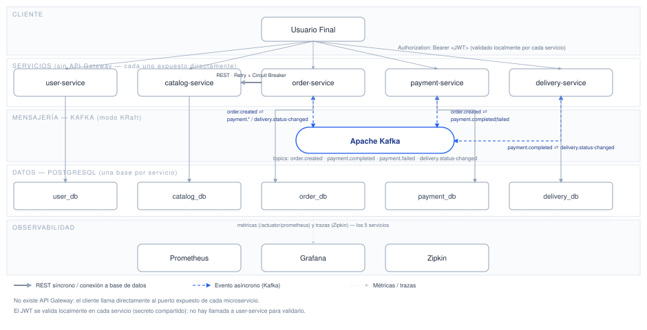
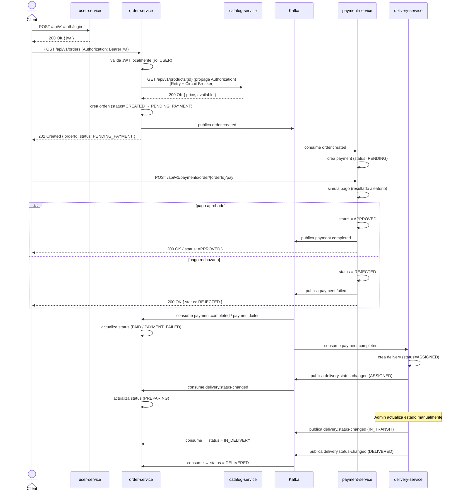

# Sistema de Pedidos de Comida — Documento de Arquitectura Técnica

**Estilo arquitectónico:** Microservicios + Event-Driven Architecture, Clean Architecture por servicio
**Fecha:** Agosto 2026

> Este documento es una vista **arquitectónica** del sistema: describe qué existe, cómo se comunica y por qué, sin entrar en detalles de construcción (Maven, Dockerfiles, estructura de paquetes archivo por archivo).

---

## 1. Resumen

Sistema de pedidos de comida para un único restaurante, compuesto por **5 microservicios independientes** (usuarios, catálogo, pedidos, pagos, entregas), cada uno con su propia base de datos PostgreSQL. La comunicación combina **REST síncrono** (solo donde es estrictamente necesario) y **eventos asíncronos vía Kafka** (para el flujo transaccional principal: pago → entrega). No existe API Gateway: cada servicio se expone directamente.

### 1.1 Objetivos de diseño

- Separar el dominio en microservicios con responsabilidad única y base de datos propia.
- Minimizar el acoplamiento síncrono entre servicios, favoreciendo coreografía de eventos.
- Seguridad basada en JWT emitido centralizadamente y validado localmente en cada servicio.
- Resiliencia explícita (Retry + Circuit Breaker) en el único punto de comunicación síncrona crítica.
- Observabilidad completa: métricas y trazabilidad distribuida.
- Internamente, cada servicio sigue Clean Architecture (dominio aislado de infraestructura).

### 1.2 Fuera de alcance

API Gateway, service discovery dinámico, notificaciones push/email, multi-restaurante, recuperación de contraseña y orquestador de sagas dedicado.

---

## 2. Stack tecnológico

| Categoría | Tecnología |
|---|---|
| Lenguaje | Java 21 |
| Framework | Spring Boot 3.5.6 |
| Persistencia | Spring Data JPA (Hibernate) |
| Base de datos | PostgreSQL 16 |
| Migraciones | Flyway |
| Mensajería | Apache Kafka (modo KRaft) |
| Seguridad | Spring Security + JWT (HS256) |
| Resiliencia | Resilience4j (Retry + Circuit Breaker) |
| Documentación API | OpenAPI 3 / Swagger UI |
| Métricas | Prometheus + Grafana |
| Trazabilidad distribuida | Zipkin |
| Contenerización / orquestación | Docker + Kubernetes |
| Arquitectura interna | Clean Architecture (domain / application / infrastructure) |

---

## 3. Diagrama de arquitectura general



**Lectura del diagrama:**

- El cliente llama directamente a cada microservicio (sin gateway), propagando el JWT en el header `Authorization`.
- `order-service` es el único servicio con una dependencia síncrona saliente hacia otro microservicio (`catalog-service`), protegida con Retry + Circuit Breaker.
- El flujo transaccional (pago y entrega) se coordina por eventos de dominio publicados en Kafka, sin orquestador central (coreografía).
- Cada servicio posee su propia base de datos PostgreSQL; ningún servicio accede a la base de datos de otro.
- Los 5 servicios exponen métricas a Prometheus y trazas a Zipkin.

### 3.1 Principios de diseño

- **Database per service** — aislamiento total de datos por microservicio.
- **Comunicación síncrona mínima** — solo `order-service → catalog-service`, porque el pedido necesita validar en tiempo real la existencia, disponibilidad y precio vigente del producto.
- **Comunicación asíncrona por eventos** — el resto del flujo (pago, entrega) se resuelve por coreografía de eventos Kafka.
- **Pago manual simulado** — a diferencia de otros pasos, la resolución del pago no ocurre automáticamente al recibir el pedido; el propio cliente dispara la simulación del pago (aprobado/rechazado aleatorio).
- **Autenticación centralizada, validación distribuida** — un único emisor de JWT (`user-service`); todos los demás servicios validan el token localmente, sin llamada de red.
- **Sin punto único de entrada** — no hay API Gateway; cada servicio expone su propio Swagger.
- **Clean Architecture por servicio** — el dominio y las reglas de negocio son independientes del framework y de los detalles técnicos de infraestructura.

---

## 4. Servicios

### 4.1 User Service

**Responsabilidad:** registro y autenticación de usuarios, emisión de JWT.

**Endpoints:**

| Método | Endpoint | Rol requerido | Descripción |
|---|---|---|---|
| POST | `/api/v1/auth/register` | Público | Registra un usuario con rol `USER` |
| POST | `/api/v1/auth/login` | Público | Valida credenciales y retorna JWT |
| GET | `/api/v1/users/me` | USER, ADMIN | Perfil del usuario autenticado |
| GET | `/api/v1/users` | ADMIN | Lista todos los usuarios |
| GET | `/api/v1/users/{id}` | ADMIN | Obtiene un usuario por id |

**Modelo de datos — `users`:** `id`, `first_name`, `last_name`, `email` (único), `password_hash`, `role` (`ADMIN`/`USER`), `created_at`, `updated_at`.

> El usuario `ADMIN` inicial se provee mediante datos semilla en la base de datos; no existe un endpoint para promover usuarios a `ADMIN`.

---

### 4.2 Catalog Service

**Responsabilidad:** gestión de productos del restaurante (no hay entidad "restaurante" porque solo existe uno).

**Endpoints:**

| Método | Endpoint | Rol requerido | Descripción |
|---|---|---|---|
| GET | `/api/v1/products` | USER, ADMIN | Lista productos |
| GET | `/api/v1/products/{id}` | USER, ADMIN | Obtiene un producto por id |
| POST | `/api/v1/products` | ADMIN | Crea un producto |
| PUT | `/api/v1/products/{id}` | ADMIN | Actualiza un producto (precio, disponibilidad, stock) |

**Modelo de datos — `products`:** `id`, `name`, `description`, `price`, `category`, `available`, `stock_quantity`, `created_at`, `updated_at`.

> Es el único servicio invocado sincrónicamente por `order-service` (para validar existencia, disponibilidad y precio de cada producto al crear un pedido).

---

### 4.3 Order Service

**Responsabilidad:** creación y ciclo de vida del pedido; actualiza su estado según los eventos de pago y entrega.

**Endpoints:**

| Método | Endpoint | Rol requerido | Descripción |
|---|---|---|---|
| POST | `/api/v1/orders` | USER | Crea un pedido (valida productos contra catalog-service) |
| GET | `/api/v1/orders/{id}` | USER (dueño), ADMIN | Detalle de un pedido |
| GET | `/api/v1/orders` | USER (propios), ADMIN (todos) | Lista pedidos |
| PATCH | `/api/v1/orders/{id}/cancel` | USER (dueño), ADMIN | Cancela un pedido (solo si aún no fue pagado) |

**Modelo de datos:**

- `orders`: `id`, `user_id`, `status`, `delivery_address`, `total_amount`, `created_at`, `updated_at`.
- `order_items`: `id`, `order_id`, `product_id`, `product_name` (snapshot), `unit_price` (snapshot), `quantity`, `subtotal`.

**Máquina de estados:**

```
CREATED → PENDING_PAYMENT → PAID → PREPARING → IN_DELIVERY → DELIVERED
                     ↓
              PAYMENT_FAILED
CREATED/PENDING_PAYMENT → CANCELLED
```

**Eventos:** publica `order.created`; consume `payment.completed`, `payment.failed`, `delivery.status-changed`.

---

### 4.4 Payment Service

**Responsabilidad:** simular el pago de un pedido. El registro de pago se crea automáticamente al recibir `order.created` (estado `PENDING`), pero su resolución (aprobado/rechazado) es **manual**, disparada por el cliente.

**Endpoints:**

| Método | Endpoint | Rol requerido | Descripción |
|---|---|---|---|
| GET | `/api/v1/payments/{id}` | USER (dueño), ADMIN | Obtiene un pago por id |
| GET | `/api/v1/payments/order/{orderId}` | USER (dueño), ADMIN | Obtiene el pago asociado a un pedido |
| POST | `/api/v1/payments/order/{orderId}/pay` | USER (dueño) | Simula el pago: resuelve `PENDING` a `APPROVED` o `REJECTED` de forma aleatoria |

**Modelo de datos — `payments`:** `id`, `order_id`, `user_id`, `amount`, `status` (`PENDING`/`APPROVED`/`REJECTED`), `payment_method`, `transaction_reference`, `created_at`, `updated_at`.

**Eventos:** consume `order.created`; publica `payment.completed` o `payment.failed` (al resolverse el pago).

---

### 4.5 Delivery Service

**Responsabilidad:** gestionar la entrega de un pedido una vez aprobado el pago.

**Endpoints:**

| Método | Endpoint | Rol requerido | Descripción |
|---|---|---|---|
| GET | `/api/v1/deliveries/order/{orderId}` | USER (dueño), ADMIN | Obtiene la entrega asociada a un pedido |
| PATCH | `/api/v1/deliveries/{id}/status` | ADMIN | Actualiza el estado (simula avance del repartidor) |

**Modelo de datos — `deliveries`:** `id`, `order_id`, `delivery_address`, `status` (`ASSIGNED`/`IN_TRANSIT`/`DELIVERED`/`FAILED`), `courier_name`, `created_at`, `updated_at`.

**Eventos:** consume `payment.completed`; publica `delivery.status-changed`.

---

## 5. Contratos de eventos (Kafka)

Envoltorio común de evento:

```json
{
  "eventId": "uuid",
  "eventType": "order.created",
  "occurredAt": "2026-08-11T15:30:00Z",
  "payload": { }
}
```

| Topic | Productor | Consumidores | Payload principal |
|---|---|---|---|
| `order.created` | order-service | payment-service | `orderId`, `userId`, `totalAmount`, `deliveryAddress` |
| `payment.completed` | payment-service | order-service, delivery-service | `orderId`, `paymentId`, `amount` |
| `payment.failed` | payment-service | order-service | `orderId`, `paymentId`, `reason` |
| `delivery.status-changed` | delivery-service | order-service | `orderId`, `deliveryId`, `status` |

Cada consumidor usa su propio `group.id` y valida idempotencia antes de procesar (tolerancia a redelivery at-least-once de Kafka).

---

## 6. Seguridad: JWT y autorización

- `user-service` es el único emisor de JWT (HS256, secreto compartido `JWT_SECRET`), con claims `sub` (userId), `email`, `role`, `iat`, `exp`.
- El cliente envía el token en `Authorization: Bearer <jwt>` a cualquier servicio. `order-service` propaga ese mismo header al llamar a `catalog-service`.
- Cada servicio valida el JWT **localmente** (firma + expiración) usando el secreto compartido — no hay llamadas de red para validar tokens.
- Autorización por rol (`ADMIN` / `USER`) aplicada por endpoint; para recursos propios (pedidos, pagos, entregas), se valida además que el `userId` del recurso coincida con el `sub` del token.

---

## 7. Resiliencia: Retry y Circuit Breaker

Aplicado únicamente sobre la llamada síncrona crítica `order-service → catalog-service`, con Resilience4j:

- **Retry:** hasta 3 intentos con backoff de 300ms ante errores de red/timeout.
- **Circuit Breaker:** ventana de 10 llamadas, umbral de fallo 50%, 10s en estado abierto antes de pasar a *half-open* (3 llamadas de prueba).
- Si el circuito está abierto, `order-service` responde `503 Service Unavailable` sin seguir golpeando a `catalog-service`, permitiendo su recuperación.

Los demás flujos son asíncronos vía Kafka, que ya tolera indisponibilidad temporal por el propio broker.

---

## 8. Flujo end-to-end de un pedido



---

## 9. Documentación de API

Cada microservicio expone su propia documentación OpenAPI 3 / Swagger UI (`/swagger-ui.html`, `/v3/api-docs`), con esquema de seguridad `bearerAuth` (JWT) sobre los endpoints protegidos.

---

## 10. Observabilidad

- **Métricas:** cada servicio expone `/actuator/prometheus`; Prometheus centraliza el scraping de los 5 servicios; Grafana consume Prometheus como datasource para dashboards de latencia, tasa de error, estado del circuit breaker y lag de consumidores Kafka.
- **Trazabilidad distribuida:** cada servicio reporta trazas a Zipkin (muestreo 100% en entorno académico), cubriendo tanto el tramo síncrono (`order-service → catalog-service`) como los tramos asíncronos vía Kafka (propagación automática de contexto de traza en los headers del mensaje).

---

## 11. Despliegue

### 11.1 Contenerización

Cada microservicio se empaqueta en una imagen Docker liviana (solo runtime, `eclipse-temurin:21-jre-alpine`); el build del `.jar` ocurre fuera de la imagen (Maven), no dentro del `Dockerfile`.

### 11.2 Kubernetes

Cada microservicio se despliega como un `Deployment` independiente con su propio `Service` (sin capa de ruteo compartida), `ConfigMap`/`Secret` para configuración y credenciales, y *probes* de salud sobre `/actuator/health`. La infraestructura compartida (PostgreSQL, Kafka, Prometheus, Grafana, Zipkin) se despliega igualmente dentro del mismo namespace (`food-ordering`).

---

## 12. Resumen de decisiones de diseño

| Decisión | Motivo |
|---|---|
| Clean Architecture por servicio | Aísla las reglas de negocio de frameworks y detalles técnicos |
| Pago manual simulado (vs. automático) | Permite simular escenarios de éxito/fallo controlados por el propio cliente |
| JWT con secreto compartido (HS256) | Propagación simple entre servicios sin gestión de claves públicas |
| Kafka en modo KRaft, broker único | Reduce componentes de infraestructura en un proyecto académico |
| Coreografía de eventos (sin orquestador) | El flujo es lineal y simple (pago → entrega) |
